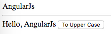

AngularJS1 Directive "bindToController" Demo
===============================================

`bindToController`是作为一个补丁出现的。

我们在directive中，如果决定同时使用`controllerAs`和isolated scope，就会陷入矛盾：

- isolated scope会把变量绑定到`$scope`上
- `controllerAs`会从controller本身而不是`$scope`上寻找变量

`bindToController`的出现是用来在这种情况下代替isolated scope，使用它会把变量绑定到controller上，而不是`$scope`上。

```
npm install
open index.html
```



Resources
---------

- 强烈推荐这篇文章：<https://blog.thoughtram.io/angularjs/2015/01/02/exploring-angular-1.3-bindToController.html>
- AngularJS1: <https://angularjs.org/>
- AngularJS1 style guide, highly recommended: <https://github.com/johnpapa/angular-styleguide/blob/master/a1/README.md#controllers>
- directive api: https://docs.angularjs.org/api/ng/service/$compile#directive-definition-object
- $element api: https://docs.angularjs.org/api/ng/function/angular.element#angularjs-s-jqlite